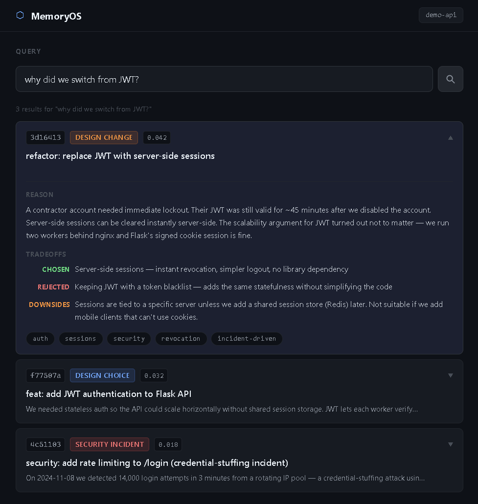

# MemoryOS

> Coding agents can read your code. They have no memory of why it is the way it is.

Git records what changed. MemoryOS records why — and makes it queryable by any agent or developer.

---

## The problem

Every time a coding agent starts a new session, it starts blind. It can read your codebase but has no access to the decisions that shaped it. Why did you switch from JWT to sessions? Why is Redis here? Why is the rate limit set to 10 req/min?

That context lives in the head of your colleague who switched teams, a Teams chat you're not a part of, and these days by an agent whose context window is 90% full and can't triage why.

MemoryOS is the missing layer between your git history and your agent's context window.

---

## What it does

- Stores structured "why" alongside every commit — reason, tradeoffs, what was rejected
- Makes that memory queryable in natural language
- Exposes it via REST API and MCP so any coding agent can retrieve it as context
- Visualizes your repo's decision history so you can understand a codebase at a glance

---

## Demo



Ask: *"why did we switch from JWT?"*

MemoryOS returns:
- The exact commit
- The incident that triggered it (contractor account couldn't be locked out for 45 min)
- What was rejected (JWT + denylist)
- Known downsides of the decision made

No digging through PRs. No asking a teammate. No re-explaining to your agent.

---

## Running locally

**1. Ingest the demo repo**

```bash
cd core
python ingest.py ../demo-repo/memory_reasons.json --repo demo-api
```

**2. Start the API server**

```bash
uvicorn core.server:app --port 8000
```

**3. Start the UI**

```bash
cd ui
npm install && npm run dev
```

Open `http://localhost:5173` — the demo repo is preloaded.

**4. Query via API directly**

```bash
curl "http://localhost:8000/search?query=why+did+we+add+rate+limiting&repo=demo-api"
```

---

## MCP integration

MemoryOS exposes a `search_memory` tool via MCP. Add this to your Cursor or Claude Code config:

```json
{
  "mcpServers": {
    "memoryos": {
      "command": "python",
      "args": ["core/mcp_server.py"]
    }
  }
}
```

Your agent can now call `search_memory` to retrieve context before making changes.

---

## Architecture

```
memory_reasons.json → ingest → SQLite → TF-IDF retrieval → FastAPI → UI / MCP
```

**Project structure**

```
memoryos/
├── demo-repo/          crafted git repo with memory_reasons.json
├── core/
│   ├── store.py        SQLite layer
│   ├── ingest.py       reads reasons file, stores memory
│   ├── retrieval.py    TF-IDF semantic search
│   ├── server.py       FastAPI REST API
│   └── mcp_server.py   MCP server for agent integration
└── ui/                 React + TypeScript
```

---

## v1 vs what's coming

**v1 (this repo)**
- Manual `memory_reasons.json` — developer writes the why
- TF-IDF retrieval
- Timeline UI + natural language query
- REST API + MCP

**v2**
- Auto-capture — agent commits, MemoryOS intercepts, structured reason extracted automatically
- Neural embeddings replacing TF-IDF
- Graph UI — entities, relationships, decisions as nodes and edges
- Parallel agent support — multiple agents share one memory layer, no conflicts

---

## Why this isn't solved by mem0 or Graphiti

Both are built for conversational agents. Their memory primitive is extracting facts from dialogue.

A coding agent's world is different — it's decisions with tradeoffs, failures that revealed design constraints, branches representing parallel realities. None of that maps to conversation facts.

MemoryOS is built around coding-native memory primitives: `decision`, `incident`, `tradeoff`, `invariant`. The unit of memory is a commit, not a message.

---

## Status

Early. v1 proves the retrieval thesis. If you're building coding agents and want to talk, open an issue or reach out.
